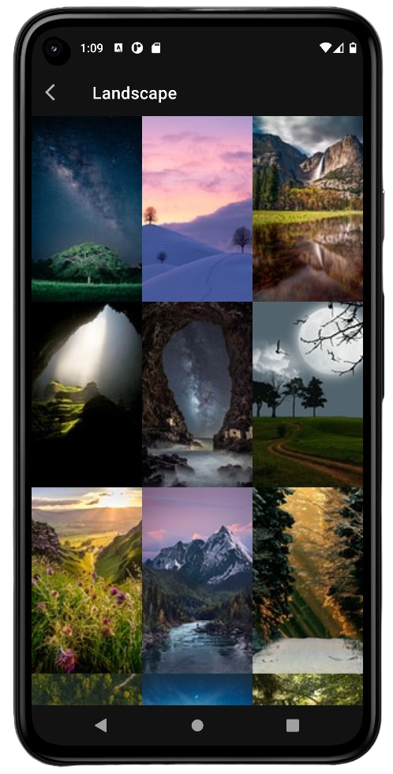
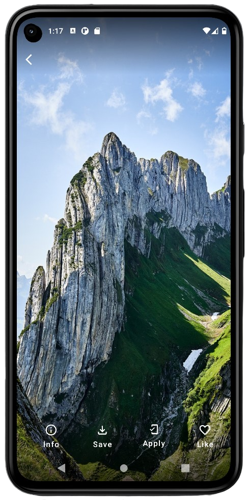
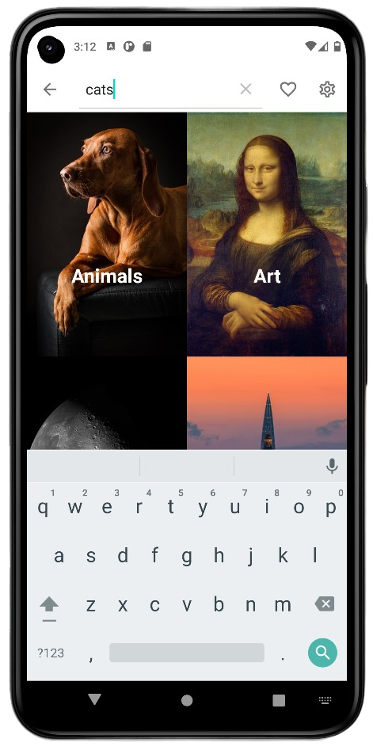
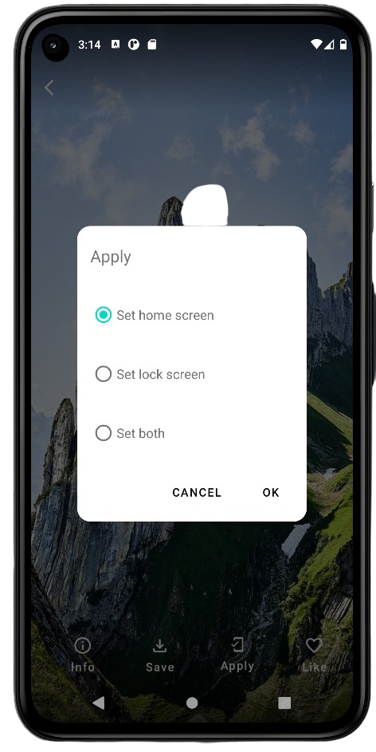

# Fresh Wallpapers
## Description
Fresh Wallpapers is a free and open source application for Android.  
The application offers images from professional and amateur photographers.

## Downloads

## Screenshots
 

## Features
- [x] Wallpapers for home and lock screen
- [x] Saving images
- [x] Favorites
- [x] Search images on pixabay.com
- [x] Light, dark or system appearance mode
- [x] Link to support picture authors

